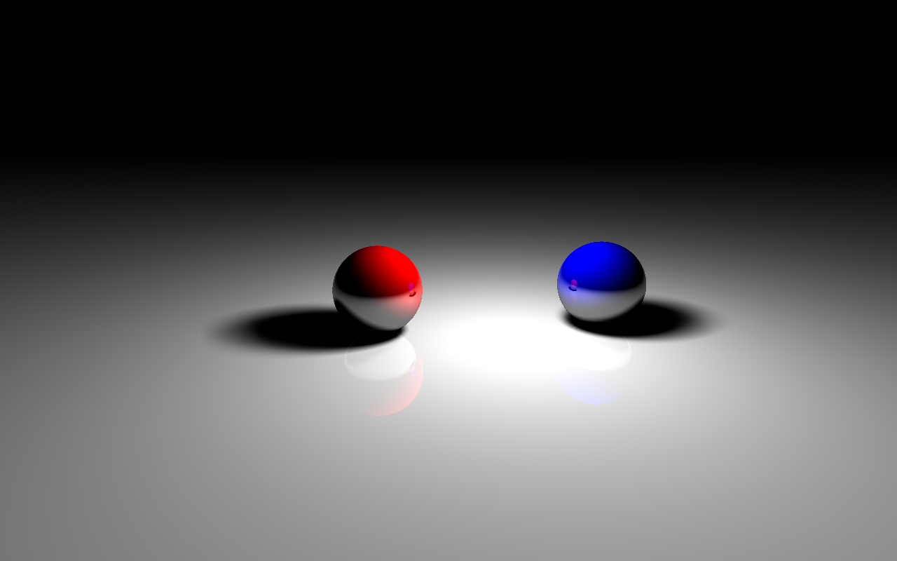

This is a simple raytracer that uses my own math vector class. It doesn't
use OpenGL or any fancy libraries---everything is from scratch. I wrote this
and reinvented the wheel a bit to practice C++ and realize a longstanding
nerdy dream to write a raytracer.  Spheres, planes, cylinders, point lights,
spotlights, area lights, reflections, and shadows are supported. Check out
this sample render:

See `example.dat` in the root directoy for a demonstration of the scene 
description language that is used to specify the scenes. If you modify this 
file you can render the new scene by typing `make view`. Make sure you have 
Eye of Gnome and the Boost libraries installed. On Ubuntu you can install them
by apt-getting `eog` and `libboost-all-dev`.
  
If you want more control over image dimensions, the file format, and so forth
type `./rt` and read the output for instructions. I recommend running the 
raytracer like `./rt <width> <height> -s < example.dat | display -`. All 
comments are written so that `doxygen` can generate documentation from
the source; just type `make docs` to build it into the `doc` folder. There
are some LaTeX formulas in the docs to help with comprehension of the math.

The Google test libraries needed for unit testing are included in 
this repository and are automatically built by the makefile. There is fairly
good unit test coverage; look at some of the test suites to familiarize
yourself with the provided classes.
